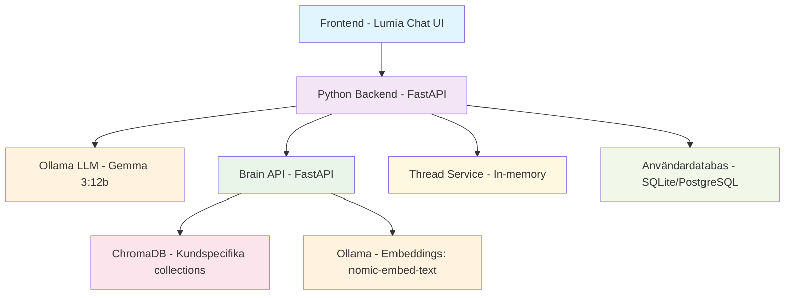

# Lumia - Lokal AI-chattjänst med personligt minne

[](https://python.org)
[](https://fastapi.tiangolo.com)
[](https://ollama.ai)
[](https://chromadb.com)

> **Lumia** är en lokal, säker och personlig AI-chattjänst som kombinerar styrkan i stora språkmodeller (LLM) med ett kontinuerligt växande personligt minne. Genom att koppla ihop en lokal språkmodell (via Ollama) med en sökmotor för kontext (Brain-tjänsten) som använder RAG och ChromaDB, bygger Lumia upp en användarspecifik förståelse som förbättras över tid.

## 🎯 Vision

Målet är att skapa en privat, responsiv assistent som förstår vem du är och anpassar sina svar – utan att skicka någon data till molnet.

## 🚀 Huvudfunktioner

- **Chatbaserad användarupplevelse** med direkt streaming av svar från lokal språkmodell
- **🧵 Trådbaserade konversationer** med fullständig konversationshistorik (upp till 50 meddelanden)
- **Användarspecifikt minne** som växer över tid genom kontinuerlig ingestion av dialoghistorik
- **Parallell RAG-analys** via mikrotjänsten *Brain* för kontextuell förstärkning
- **Säker och lokal datalagring** via ChromaDB, med en collection per användare
- **Registrering och inloggning** (med planerad JWT-autentisering)
- **Framtidssäkrad struktur** för att utöka med olika typer av kontextstrategier och specialiserade agents

## 🏗️ Systemarkitektur



## 📋 Komponenter

### 💬 LLM Chatmotor (via Ollama)
- Lokal LLM-modell, t.ex. `qwen2.5:7b`
- Streamar svaret för snabb interaktion
- Används alltid som primär generator

### 🧠 Brain RAG Service
- Fristående FastAPI-mikrotjänst
- Tar emot frågor och söker i kundspecifika ChromaDB-collections
- RAG-modell bygger svar via Ollama
- All embedding-generering sker lokalt (nomic-embed-text)
- Dashboard för dokumenthantering

### 📚 Kontextinjektion
- Svar från *Brain* kan komplettera eller ersätta svar från LLM
- Regler behövs för när RAG-kontext ska användas

### 🧵 Trådbaserade konversationer
- Persistenta konversationssessioner med fullständig historik
- Automatisk token-hantering för att undvika overflow
- Kombinerar trådhistorik med Brain-kontext och persona
- In-memory lagring för snabb åtkomst

### 👤 Användarhantering
- Registrering, inloggning och autentisering via JWT
- Varje användare tilldelas en unik collection i Brain, ex: `lumia_100023`
- Alla chattar kan sparas automatiskt i denna collection
- Möjlighet att visa historik i framtiden via dashboard eller export

## 🛠️ Teknisk Stack

| Komponent | Verktyg / Modell | Notering |
|-----------|------------------|----------|
| **LLM** | Ollama (`gemma3:12b`) | Lokal, 12B parametrar |
| **Embeddings** | Ollama (`nomic-embed-text`) | Lokal, vektorer |
| **Vektordatabas** | ChromaDB | Per användare |
| **Backend** | Python, FastAPI | JWT, routing |
| **Kontextmotor** | Brain (FastAPI) | RAG med LLM |
| **Orkestrering** | LangChain | Framtida kedjor |
| **Användardata** | PostgreSQL / SQLite | Inloggning |
| **UI** | Web/terminal/chatbot | Anpassningsbar |

## 📦 Installation

### Förutsättningar

1. **Ollama** installerat och körande
2. **Python 3.8+**
3. **Docker** (valfritt för ChromaDB)

### Snabbstart

```bash
# Klona projektet
git clone <repository-url>
cd lumia

# Installera dependencies
pip install -r requirements.txt

# Starta Brain-tjänsten
cd brain
uvicorn main:app --reload --port 8001

# Starta huvudapplikationen (i ny terminal)
cd ..
uvicorn main:app --reload --port 8000
```

### Ollama-modeller

```bash
# Ladda ner LLM-modell
ollama pull gemma3:12b

# Ladda ner embedding-modell
ollama pull nomic-embed-text
```

## 🔧 Konfiguration

Skapa en `.env`-fil i projektroten:

```env
# Ollama-inställningar
OLLAMA_BASE_URL=http://localhost:11434
LLM_MODEL=qwen2.5:7b
EMBEDDING_MODEL=nomic-embed-text

# Brain API
BRAIN_API_URL=http://localhost:8001

# Databas
DATABASE_URL=sqlite:///./lumia.db

# JWT
SECRET_KEY=your-secret-key-here
ALGORITHM=HS256
ACCESS_TOKEN_EXPIRE_MINUTES=30

# ChromaDB
CHROMA_PERSIST_DIRECTORY=./chroma_db
```

## 🚀 Användning

### Memory Service API

Lumia's memory service provides a powerful API for external applications to interact with the AI assistant using brain-specific memory and context.

#### Chat with Memory Context

**POST /memory/chat** (Non-streaming)
Simple chat response with memory context - returns complete JSON response:

```json
POST /memory/chat
{
  "user_id": "brain_12345",
  "message": "What did we discuss about API keys last week?"
}
```

**Response:**
```json
{
  "response": "Based on our conversation last week, we discussed implementing API key authentication...",
  "user_id": "brain_12345",
  "context_used": true,
  "context_length": 1250,
  "response_length": 450,
  "persona_included": true,
  "processing_time_ms": 2340.5
}
```

**POST /memory/chat/stream** (Streaming)
Stream a chat response using the memory system with brain-specific context:

```json
POST /memory/chat/stream
{
  "user_id": "brain_12345",
  "message": "What did we discuss about API keys last week?"
}
```

**Response:** Server-Sent Events (SSE) stream with AI response chunks.

**Features:**
- Uses cached memory for immediate responses
- Updates memory in background
- Brain-specific context retrieval
- Persona profile integration
- Real-time context from vector store
- **Multi-account support:** Each `user_id` (brain ID) has isolated memory cache
- **Unique cache keys:** Local memory is keyed by brain ID for complete isolation
- **Two integration options:** Simple JSON responses or real-time streaming

### Router API (small-model routing + verktyg)

Lumia innehåller en router som låter en liten modell bestämma om Brain‑kontext ska hämtas och vilka verktyg (funktioner) som ska köras. Verktyg kan registreras permanent eller skickas ad‑hoc per anrop. Lumia anropar dina verktyg via HTTP från servern och väntar på svaret innan slutsvaret genereras.

End points:
- `POST /router/chat` – skicka med `user_id`, `message` och valfritt `tools` (lista)
- `GET /router/tools` – lista registrerade verktyg
- `POST /router/tools/register` – registrera/uppdatera verktyg
- `DELETE /router/tools/{name}` – ta bort verktyg

Pydantic‑modeller (förenklat):
```json
ToolDefinition {
  "name": "str",
  "description": "str",
  "callback_url": "http(s)://...",
  "input_hint": "str?"
}

RouterChatRequest {
  "user_id": "str",
  "message": "str",
  "tools": [ToolDefinition]?  // valfritt, ad‑hoc per anrop
}
```

Registrera ett verktyg:
```bash
curl -X POST http://localhost:8002/router/tools/register \
  -H "Content-Type: application/json" \
  -d '{
    "name": "get_weather",
    "description": "Hämtar väder för en plats.",
    "callback_url": "http://localhost:9000/tools/get_weather"
  }'
```

Anropa routern med flera verktyg (ad‑hoc eller registrerade):
```bash
curl -X POST http://localhost:8002/router/chat \
  -H "Content-Type: application/json" \
  -d '{
    "user_id": "lumia_100023",
    "message": "Behöver jag paraply i Stockholm idag? Sammanfatta också senaste dialogen.",
    "tools": [
      {
        "name": "get_weather",
        "description": "Hämtar väder.",
        "callback_url": "http://localhost:9000/tools/get_weather"
      },
      {
        "name": "summarize_last_chat",
        "description": "Sammanfattar senaste dialogen.",
        "callback_url": "http://localhost:9000/tools/summarize_last_chat"
      }
    ]
  }'
```

Exempelsvar (förkortat):
```json
{
  "response": "...",
  "used_brain": true,
  "tools_invoked": [
    {"name":"get_weather","ok":true,"content":"Lätt regn i em."},
    {"name":"summarize_last_chat","ok":true,"content":"Vi pratade om ..."}
  ],
  "context_length": 1379,
  "response_length": 512
}
```

Observera om `localhost`: Lumia anropar dina verktyg från servern. Kör verktygsservern på samma maskin? Använd `http://localhost:9000/...`. Körs den på annan maskin/containernät? Använd en adress som Lumia kan nå, t.ex. `http://192.168.68.114:9000/...`.

#### Memory Statistics

**GET /memory/stats/{user_id}**
Get memory statistics for a specific brain:

```bash
GET /memory/stats/brain_12345
```

**Response:**
```json
{
  "user_id": "brain_12345",
  "memory_stats": {
    "user_id": "brain_12345",
    "has_context": true,
    "context_length": 1250,
    "has_persona": true,
    "persona_last_updated": "2024-01-15T10:30:00"
  }
}
```

#### Clear Memory

**POST /memory/clear/{user_id}**
Clear memory for a specific brain:

```bash
POST /memory/clear/brain_12345
```

#### Health Check

**GET /memory/health**
Check memory service status:

```bash
GET /memory/health
```

**Response:**
```json
{
  "status": "healthy",
  "service": "Memory",
  "memory_cache_size": 5
}
```

### Brain API Integration

**/ingest**
Spara ny konversation:

```json
POST /ingest
{
  "customer_id": "lumia_100023",
  "content": "Användarens fråga + LLM-svar",
  "metadata": {
    "source": "chat",
    "timestamp": "2025-08-03T12:00:00Z"
  }
}
```

**/query**
Sök i tidigare kontext:

```json
POST /query
{
  "customer_id": "lumia_100023",
  "question": "Vad sa jag förra veckan om API-nycklar?",
  "n_results": 3
}
```

### Exempel på användning

#### Basic Chat (Legacy)
```python
import requests

# Skicka chattmeddelande
response = requests.post("http://localhost:8000/chat", json={
    "message": "Vad sa jag förra veckan om API-nycklar?",
    "user_id": "lumia_100023"
})

# Svaret streamas tillbaka
for chunk in response.iter_content(chunk_size=1024):
    print(chunk.decode(), end='')
```

#### Memory Service API (Recommended)

**Option 1: Simple JSON Response (Easier Integration)**
```python
import requests

def chat_with_memory_simple(brain_id: str, message: str):
    """Simple chat with memory - returns complete JSON response."""
    response = requests.post(
        "http://localhost:8000/memory/chat",
        json={
            "user_id": brain_id,  # Use brain_id as user_id
            "message": message
        }
    )
    
    result = response.json()
    print(f"Response: {result['response']}")
    print(f"Processing time: {result['processing_time_ms']}ms")
    print(f"Context used: {result['context_used']}")
    
    return result['response']

# Example usage for multiple brains
brain_1_response = chat_with_memory_simple("brain_12345", "What's my favorite color?")
brain_2_response = chat_with_memory_simple("brain_67890", "What's my favorite color?")  # Different context
```

**Option 2: Real-time Streaming (Advanced Integration)**
```python
import requests
import json

def chat_with_memory_stream(brain_id: str, message: str):
    """Streaming chat with memory - real-time response chunks."""
    response = requests.post(
        "http://localhost:8000/memory/chat/stream",
        json={
            "user_id": brain_id,
            "message": message
        },
        stream=True
    )
    
    full_response = ""
    for line in response.iter_lines():
        if line:
            data = json.loads(line.decode('utf-8').replace('data: ', ''))
            if 'chunk' in data:
                chunk = data['chunk']
                print(chunk, end='', flush=True)
                full_response += chunk
            elif 'done' in data:
                print("\n--- Response complete ---")
                break
    
    return full_response
```

### 🧵 Thread System API (New!)

Lumia now supports **conversation threads** - persistent conversation sessions that maintain full context history. This is perfect for long-running conversations where the AI needs to remember the entire dialogue.

**Key Feature: Dynamic Brain Selection**
Each thread can use a different brain ID, allowing you to have separate memory contexts for different conversations or use cases.

**Key Feature: Dynamic System Prompts**
Control AI behavior dynamically by providing custom system prompts for each thread or message. This allows you to create different AI personalities and behaviors.

#### Thread Management

**Create a new thread:**
```bash
POST /threads/
{
  "user_id": "user123",
  "brain_id": "brain_work",  # Required: which brain to use for this thread
  "system_prompt": "Du är en professionell affärskonsult. Var alltid hövlig och formell.",  # Optional: control AI behavior
  "title": "My conversation about projects",
  "initial_message": "Hej, jag vill prata om mina projekt"
}
```

**Response:**
```json
{
  "thread_id": "550e8400-e29b-41d4-a716-446655440000",
  "user_id": "user123",
  "brain_id": "brain_work",
  "system_prompt": "Du är en professionell affärskonsult. Var alltid hövlig och formell.",
  "title": "My conversation about projects",
  "created_at": "2024-01-15T10:30:00",
  "updated_at": "2024-01-15T10:30:00",
  "message_count": 1,
  "last_message": "Hej, jag vill prata om mina projekt"
}
```

**List user's threads:**
```bash
GET /threads/user/user123
```

**Get specific thread:**
```bash
GET /threads/550e8400-e29b-41d4-a716-446655440000
```

#### Thread Chat

**Send message in thread (JSON response):**
```bash
POST /threads/550e8400-e29b-41d4-a716-446655440000/chat
{
  "message": "Vilken plattform tänker du på?",
  "user_id": "user123",
  "thread_id": "550e8400-e29b-41d4-a716-446655440000",
  "brain_id": "brain_work",  # Optional: override thread's brain_id
  "system_prompt": "Du är en teknikexpert. Ge detaljerade tekniska svar."  # Optional: override thread's system_prompt
}
```

**Send message in thread (Streaming):**
```bash
POST /threads/550e8400-e29b-41d4-a716-446655440000/chat/stream
{
  "message": "Vilken plattform tänker du på?",
  "user_id": "user123",
  "thread_id": "550e8400-e29b-41d4-a716-446655440000",
  "brain_id": "brain_work",  # Optional: override thread's brain_id
  "system_prompt": "Du är en teknikexpert. Ge detaljerade tekniska svar."  # Optional: override thread's system_prompt
}
```

**Get thread messages:**
```bash
GET /threads/550e8400-e29b-41d4-a716-446655440000/messages?limit=10
```

**Delete thread:**
```bash
DELETE /threads/550e8400-e29b-41d4-a716-446655440000?user_id=user123
```

#### Memory Chat with Brain Selection

**Simple memory chat with brain_id:**
```bash
POST /memory/chat
{
  "message": "Vad sa jag om Bowter?",
  "user_id": "user123",
  "brain_id": "brain_work",  # Optional: use specific brain
  "system_prompt": "Du är en analytisk konsult. Ge korta, sakliga svar."  # Optional: control AI behavior
}
```

**Streaming memory chat with brain_id:**
```bash
POST /memory/chat/stream
{
  "message": "Vad sa jag om Bowter?",
  "user_id": "user123",
  "brain_id": "brain_work",  # Optional: use specific brain
  "system_prompt": "Du är en analytisk konsult. Ge korta, sakliga svar."  # Optional: control AI behavior
}
```

#### Python Example - Thread Chat with Brain Selection and System Prompts

```python
import requests
import json

class LumiaThreadClient:
    def __init__(self, base_url="http://localhost:8002"):
        self.base_url = base_url
    
    def create_thread(self, user_id: str, brain_id: str, system_prompt: str = None, title: str = None, initial_message: str = None):
        """Create a new conversation thread with specific brain and system prompt."""
        data = {"user_id": user_id, "brain_id": brain_id}
        if system_prompt:
            data["system_prompt"] = system_prompt
        if title:
            data["title"] = title
        if initial_message:
            data["initial_message"] = initial_message
        
        response = requests.post(f"{self.base_url}/threads/", json=data)
        return response.json()
    
    def chat_in_thread(self, thread_id: str, user_id: str, message: str, brain_id: str = None, system_prompt: str = None):
        """Send a message in a thread and get response."""
        data = {
            "message": message,
            "user_id": user_id,
            "thread_id": thread_id
        }
        if brain_id:
            data["brain_id"] = brain_id
        if system_prompt:
            data["system_prompt"] = system_prompt
        
        response = requests.post(f"{self.base_url}/threads/{thread_id}/chat", json=data)
        return response.json()
    
    def memory_chat(self, user_id: str, message: str, brain_id: str = None, system_prompt: str = None):
        """Simple memory chat with optional brain selection and system prompt."""
        data = {"user_id": user_id, "message": message}
        if brain_id:
            data["brain_id"] = brain_id
        if system_prompt:
            data["system_prompt"] = system_prompt
        
        response = requests.post(f"{self.base_url}/memory/chat", json=data)
        return response.json()
    
    def get_thread_messages(self, thread_id: str, limit: int = None):
        """Get messages from a thread."""
        params = {}
        if limit:
            params["limit"] = limit
        
        response = requests.get(f"{self.base_url}/threads/{thread_id}/messages", params=params)
        return response.json()
    
    def list_user_threads(self, user_id: str):
        """List all threads for a user."""
        response = requests.get(f"{self.base_url}/threads/user/{user_id}")
        return response.json()

# Example usage with different brains and system prompts
client = LumiaThreadClient()

# Create professional work thread
work_thread = client.create_thread(
    user_id="user123",
    brain_id="brain_work",
    system_prompt="Du är en professionell affärskonsult. Var alltid hövlig, formell och fokuserad på affärsmål.",
    title="Work Projects",
    initial_message="Hej, jag har jobbat med Bowter och reemove.ai"
)

# Create casual personal thread
personal_thread = client.create_thread(
    user_id="user123", 
    brain_id="brain_personal",
    system_prompt="Du är en avslappnad och vänlig kompis. Använd informell svenska, var rolig och lekfull.",
    title="Personal Chat",
    initial_message="Hej! Vad händer?"
)

# Chat in work thread (uses thread's system prompt)
work_response = client.chat_in_thread(
    work_thread["thread_id"], 
    "user123", 
    "Vilken plattform tänker du på?",
    "brain_work"
)

# Chat in personal thread (uses thread's system prompt)
personal_response = client.chat_in_thread(
    personal_thread["thread_id"],
    "user123", 
    "Vad gillar jag att göra på fritiden?"
)

# Override system prompt for one message
override_response = client.chat_in_thread(
    work_thread["thread_id"],
    "user123",
    "Berätta en rolig historia",
    "brain_work",
    "Du är en standup-komiker. Var rolig och berätta en kort historia."
)

# Memory chat with specific brain and system prompt
work_memory = client.memory_chat("user123", "Vad sa jag om Bowter?", "brain_work", "Du är en analytisk konsult. Ge korta, sakliga svar.")
personal_memory = client.memory_chat("user123", "Vad sa jag om mina hobbies?", "brain_personal", "Du är en vänlig kompis. Var entusiastisk och stöttande.")
```

#### Brain Selection Use Cases

1. **Work vs Personal**: Use `brain_work` for professional conversations, `brain_personal` for private chats
2. **Project-specific**: Use `brain_project_a` and `brain_project_b` for different projects
3. **Role-based**: Use `brain_assistant` and `brain_friend` for different AI personalities
4. **Temporal**: Use `brain_2024` and `brain_2025` for different time periods

#### System Prompt Use Cases

1. **Professional vs Casual**: Different formality levels and tone
2. **Expert vs Beginner**: Adjust technical depth and complexity
3. **Creative vs Analytical**: Different thinking styles and approaches
4. **Role-specific**: Teacher, consultant, friend, mentor, etc.
5. **Language and Style**: Formal Swedish, casual Swedish, technical jargon, etc.

#### Thread System Benefits

1. **Full Conversation Context** - AI sees entire dialogue history (up to 50 messages)
2. **Dynamic Brain Selection** - Use different brains for different contexts
3. **Dynamic System Prompts** - Control AI behavior and personality
4. **Token Management** - Automatic overflow prevention
5. **Fast Response** - No network delay for conversation history
6. **Hybrid Context** - Combines thread history + Brain + persona
7. **Organized** - Each conversation has its own thread
8. **Persistent** - Threads survive server restarts (in-memory for now)

#### Context Structure in Threads

When you send a message in a thread, the AI receives:

```
## Konversationshistorik:
Användare: Hej, jag har jobbat med Bowter och reemove.ai
Assistent: Det låter som du har mycket på gång! Bra att det har gått bra...
Användare: Vilken plattform tänker du på?
Assistent: Jag hittar inget i mina anteckningar om det just nu...

## Om användaren:
[Persona from Brain]

## Vector store data:
[Brain context about relevant topics]
```

This ensures the AI always has full context of the conversation and can provide coherent, contextual responses.

## 📈 Roadmap

| Version | Funktioner                                               |
| ------- | -------------------------------------------------------- |
| v0.1    | Chatgränssnitt + streaming + enkel Brain-koppling        |
| v0.2    | Inloggning + JWT + sparande till ChromaDB                |
| v0.3    | Kontextstrategier (rules for retrieval)                  |
| v0.4    | Historikvy + användarprofil                              |
| v0.5    | Multi-agent support + integrationer (e-post, Slack, etc) |

## 🤝 Bidrag

1. Forka projektet
2. Skapa en feature branch (`git checkout -b feature/amazing-feature`)
3. Committa dina ändringar (`git commit -m 'Add amazing feature'`)
4. Pusha till branchen (`git push origin feature/amazing-feature`)
5. Öppna en Pull Request

## 📄 Licens

Detta projekt är licensierat under MIT-licensen - se [LICENSE](LICENSE) filen för detaljer.

## 🆘 Support

Om du stöter på problem eller har frågor:

1. Kontrollera [Issues](https://github.com/your-repo/lumia/issues)
2. Skapa en ny issue med detaljerad beskrivning
3. Kontakta utvecklingsteamet

---

**Lumia** - Din lokala AI-assistent med personligt minne 🧠✨ 