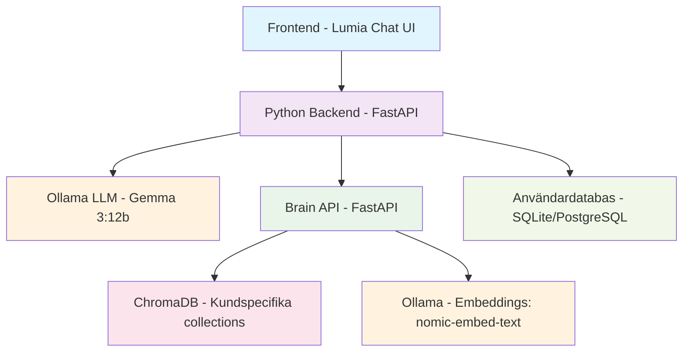

# Lumia - Lokal AI-chattjänst med personligt minne

[](https://python.org)
[](https://fastapi.tiangolo.com)
[](https://ollama.ai)
[](https://chromadb.com)

> **Lumia** är en lokal, säker och personlig AI-chattjänst som kombinerar styrkan i stora språkmodeller (LLM) med ett kontinuerligt växande personligt minne. Genom att koppla ihop en lokal språkmodell (via Ollama) med en sökmotor för kontext (Brain-tjänsten) som använder RAG och ChromaDB, bygger Lumia upp en användarspecifik förståelse som förbättras över tid.

## 🎯 Vision

Målet är att skapa en privat, responsiv assistent som förstår vem du är och anpassar sina svar – utan att skicka någon data till molnet.

## 🚀 Huvudfunktioner

- **Chatbaserad användarupplevelse** med direkt streaming av svar från lokal språkmodell
- **Användarspecifikt minne** som växer över tid genom kontinuerlig ingestion av dialoghistorik
- **Parallell RAG-analys** via mikrotjänsten *Brain* för kontextuell förstärkning
- **Säker och lokal datalagring** via ChromaDB, med en collection per användare
- **Registrering och inloggning** (med planerad JWT-autentisering)
- **Framtidssäkrad struktur** för att utöka med olika typer av kontextstrategier och specialiserade agents

## 🏗️ Systemarkitektur



## 📋 Komponenter

### 💬 LLM Chatmotor (via Ollama)
- Lokal LLM-modell, t.ex. `qwen2.5:7b`
- Streamar svaret för snabb interaktion
- Används alltid som primär generator

### 🧠 Brain RAG Service
- Fristående FastAPI-mikrotjänst
- Tar emot frågor och söker i kundspecifika ChromaDB-collections
- RAG-modell bygger svar via Ollama
- All embedding-generering sker lokalt (nomic-embed-text)
- Dashboard för dokumenthantering

### 📚 Kontextinjektion
- Svar från *Brain* kan komplettera eller ersätta svar från LLM
- Regler behövs för när RAG-kontext ska användas

### 👤 Användarhantering
- Registrering, inloggning och autentisering via JWT
- Varje användare tilldelas en unik collection i Brain, ex: `lumia_100023`
- Alla chattar kan sparas automatiskt i denna collection
- Möjlighet att visa historik i framtiden via dashboard eller export

## 🛠️ Teknisk Stack

| Komponent | Verktyg / Modell | Notering |
|-----------|------------------|----------|
| **LLM** | Ollama (`gemma3:12b`) | Lokal, 12B parametrar |
| **Embeddings** | Ollama (`nomic-embed-text`) | Lokal, vektorer |
| **Vektordatabas** | ChromaDB | Per användare |
| **Backend** | Python, FastAPI | JWT, routing |
| **Kontextmotor** | Brain (FastAPI) | RAG med LLM |
| **Orkestrering** | LangChain | Framtida kedjor |
| **Användardata** | PostgreSQL / SQLite | Inloggning |
| **UI** | Web/terminal/chatbot | Anpassningsbar |

## 📦 Installation

### Förutsättningar

1. **Ollama** installerat och körande
2. **Python 3.8+**
3. **Docker** (valfritt för ChromaDB)

### Snabbstart

```bash
# Klona projektet
git clone <repository-url>
cd lumia

# Installera dependencies
pip install -r requirements.txt

# Starta Brain-tjänsten
cd brain
uvicorn main:app --reload --port 8001

# Starta huvudapplikationen (i ny terminal)
cd ..
uvicorn main:app --reload --port 8000
```

### Ollama-modeller

```bash
# Ladda ner LLM-modell
ollama pull gemma3:12b

# Ladda ner embedding-modell
ollama pull nomic-embed-text
```

## 🔧 Konfiguration

Skapa en `.env`-fil i projektroten:

```env
# Ollama-inställningar
OLLAMA_BASE_URL=http://localhost:11434
LLM_MODEL=qwen2.5:7b
EMBEDDING_MODEL=nomic-embed-text

# Brain API
BRAIN_API_URL=http://localhost:8001

# Databas
DATABASE_URL=sqlite:///./lumia.db

# JWT
SECRET_KEY=your-secret-key-here
ALGORITHM=HS256
ACCESS_TOKEN_EXPIRE_MINUTES=30

# ChromaDB
CHROMA_PERSIST_DIRECTORY=./chroma_db
```

## 🚀 Användning

### API-anrop mot Brain

**/ingest**
Spara ny konversation:

```json
POST /ingest
{
  "customer_id": "lumia_100023",
  "content": "Användarens fråga + LLM-svar",
  "metadata": {
    "source": "chat",
    "timestamp": "2025-08-03T12:00:00Z"
  }
}
```

**/query**
Sök i tidigare kontext:

```json
POST /query
{
  "customer_id": "lumia_100023",
  "question": "Vad sa jag förra veckan om API-nycklar?",
  "n_results": 3
}
```

### Exempel på användning

```python
import requests

# Skicka chattmeddelande
response = requests.post("http://localhost:8000/chat", json={
    "message": "Vad sa jag förra veckan om API-nycklar?",
    "user_id": "lumia_100023"
})

# Svaret streamas tillbaka
for chunk in response.iter_content(chunk_size=1024):
    print(chunk.decode(), end='')
```

## 📈 Roadmap

| Version | Funktioner                                               |
| ------- | -------------------------------------------------------- |
| v0.1    | Chatgränssnitt + streaming + enkel Brain-koppling        |
| v0.2    | Inloggning + JWT + sparande till ChromaDB                |
| v0.3    | Kontextstrategier (rules for retrieval)                  |
| v0.4    | Historikvy + användarprofil                              |
| v0.5    | Multi-agent support + integrationer (e-post, Slack, etc) |

## 🤝 Bidrag

1. Forka projektet
2. Skapa en feature branch (`git checkout -b feature/amazing-feature`)
3. Committa dina ändringar (`git commit -m 'Add amazing feature'`)
4. Pusha till branchen (`git push origin feature/amazing-feature`)
5. Öppna en Pull Request

## 📄 Licens

Detta projekt är licensierat under MIT-licensen - se [LICENSE](LICENSE) filen för detaljer.

## 🆘 Support

Om du stöter på problem eller har frågor:

1. Kontrollera [Issues](https://github.com/your-repo/lumia/issues)
2. Skapa en ny issue med detaljerad beskrivning
3. Kontakta utvecklingsteamet

---

**Lumia** - Din lokala AI-assistent med personligt minne 🧠✨ 